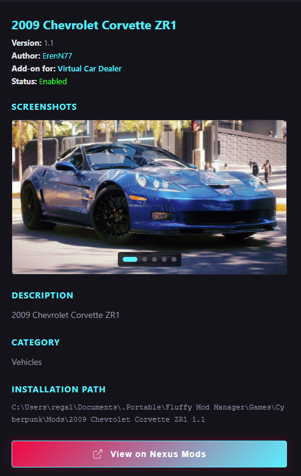

<div align="center">

# 🎮 Cyberpunk 2077 Mod Manager


**A modern, cyberpunk-themed mod manager for Cyberpunk 2077**

[Features](#-features) • [Installation](#-installation) • [Usage](#-usage) • [Screenshots](#-screenshots) • [Contributing](#-contributing)


---

</div>

## ✨ Features

### 🔧 Core Functionality
- **One-Click Mod Management** - Enable/disable mods with a single click
- **Profile System** - Create multiple mod configurations for different playstyles
- **Add-on Support** - Automatically groups main mods with their add-ons
- **Smart Requirements Detection** - Warns you about missing mod dependencies
- **Batch Operations** - Enable or disable all mods at once

### 🎨 Modern Interface
- **Cyberpunk-Themed UI** - Sleek neon design inspired by Night City
- **Dark Mode** - Easy on the eyes during long gaming sessions
- **Responsive Design** - Smooth animations and intuitive navigation
- **Screenshot Viewer** - Preview mod screenshots before enabling
- **Category Filtering** - Organize mods by category

### 🛠️ Advanced Features
- **Item Code Viewer** - Browse and copy in-game item codes directly
- **Vehicle Spawning Codes** - Quick access to vehicle spawn commands
- **Nexus Mods Integration** - Direct links to mod pages
- **Activity Logs** - Track all mod operations
- **Backup System** - Automatic configuration backups

### 📦 Technical Highlights
- **File Tracking** - Precisely tracks which files belong to each mod
- **Safe Uninstallation** - Removes only mod-specific files
- **No File Conflicts** - Intelligent file management prevents overwrites
- **Mod Source Support** - Keep your downloads separate from game files

---

## 🚀 Installation

### Prerequisites
- Windows 10/11 (64-bit)
- Cyberpunk 2077 installed
- Node.js 14+ (for development)

### Download Release (Recommended)
1. Go to [Releases](https://github.com/yourusername/cyberpunk-mod-manager/releases)
2. Download the latest `Cyberpunk-Mod-Manager-Setup.exe`
3. Run the installer
4. Launch the application

### Build from Source
```bash
# Clone the repository
git clone https://github.com/yourusername/cyberpunk-mod-manager.git
cd cyberpunk-mod-manager

# Install dependencies
npm install

# Start in development mode
npm start

# Build for production
npm run build
```

---

## 📖 Usage

### First Time Setup

1. **Set Game Path**
   - Navigate to `Settings`
   - Click `Browse` next to "Game Path"
   - Select your Cyberpunk 2077 installation folder
   - Example: `C:\Program Files (x86)\Steam\steamapps\common\Cyberpunk 2077`

2. **Set Mod Source Path** (Optional)
   - Click `Browse` next to "Mod Source Path"
   - Select the folder where you keep your downloaded mods
   - This keeps your downloads organized separately from the game

3. **Scan for Mods**
   - Click the `Scan Mods` button
   - The manager will detect all mods in your source folder

### Managing Mods

#### Enable/Disable Mods
- Click the toggle switch on any mod card
- Files are automatically copied to/from your game folder
- Changes take effect immediately

#### Working with Add-ons
- Main mods with add-ons show a yellow badge
- Click the expand button to see all add-ons
- Enable/disable the main mod and add-ons independently

#### View Mod Details
- Click on any mod card to view:
  - Screenshots (click to view fullscreen)
  - Description
  - Version and author information
  - Installation path
  - Item/vehicle codes (if available)

#### Item Codes
- Click `View Item Codes` in mod details
- Browse items by category
- Click copy button to copy console commands
- Paste directly into the game console

### Profile Management

Create different mod setups for various playstyles:

1. Click the `+` button next to the profile selector
2. Name your profile (e.g., "Performance", "Visual Overhaul", "Vanilla+")
3. Enable/disable mods specific to that profile
4. Switch profiles anytime with the dropdown

**Export/Import Profiles:**
- Share your mod lists with friends
- Backup your configurations
- Restore previous setups

---

## 📋 Mod Structure

For mods to be detected, they must follow this structure:

```
YourMod/
├── modinfo.ini          # Mod metadata (required)
├── screen.png          # Primary screenshot
├── screen2.png         # Additional screenshots (optional)
├── archive/            # Mod files
├── bin/               # Binary files
├── engine/            # Engine files
└── r6/                # Scripts
```

### modinfo.ini Format

```ini
name=My Awesome Mod
version=1.5.0
author=YourName
author2=Contributor           # Optional second author
authorlink=https://nexusmods.com/users/123
authorlink2=https://nexusmods.com/users/456
description=This mod does amazing things!
category=Weapons
modlink=https://nexusmods.com/cyberpunk2077/mods/123
addonfor=Main Mod Name        # If this is an add-on
requirements=Required Mod 1, Required Mod 2
codes=Game.AddToInventory("Items.Weapon_Example",1)
```

### Supported Fields
- `name` - Display name of the mod
- `version` - Version number
- `author` / `author2` - Creator(s)
- `authorlink` / `authorlink2` - Nexus Mods profile URLs
- `description` - What the mod does
- `category` - Classification (Weapons, Vehicles, UI, etc.)
- `modlink` - Nexus Mods page URL
- `addonfor` - Name of the main mod (for add-ons)
- `requirements` - Comma-separated list of required mods
- `codes` - In-game console commands

---

## 🖼️ Screenshots

<div align="center">

### Main Interface


### Mod Details


### Code Viewer


### Profile Management


</div>

---

## 🛡️ Safety Features

- **File Tracking** - Every file copied by a mod is tracked
- **Clean Uninstall** - Only mod-specific files are removed
- **No Overwrites** - Prevents accidental file conflicts
- **Activity Logging** - Full history of all operations
- **Backup Support** - Automatic configuration backups

---

## 🔧 Configuration

All settings are stored in:
```
%APPDATA%/cyberpunk-mod-manager/config.json
```

This file contains:
- Game and mod paths
- Active profile
- All profile configurations
- File tracking data
- User preferences

---

## 🐛 Troubleshooting

### Mods not detected
- Ensure mods have a `modinfo.ini` file
- Check that the mod source path is set correctly
- Click "Scan Mods" to refresh

### Game path invalid
- Make sure you select the root Cyberpunk 2077 folder
- The folder should contain `bin/x64/Cyberpunk2077.exe`

### Mod won't enable
- Check for missing requirements in mod details
- Verify disk space is available
- Check logs for specific error messages

### Files not removed when disabling
- The manager only removes files it installed
- Manual installations may leave files behind
- Use "Open Folder" to manually check

---

## 🤝 Contributing

Contributions are welcome! Please feel free to submit a Pull Request.

### Development Setup
```bash
git clone https://github.com/yourusername/cyberpunk-mod-manager.git
cd cyberpunk-mod-manager
npm install
npm start
```

### Building
```bash
npm run build
```

### Guidelines
- Follow the existing code style
- Test thoroughly before submitting
- Update documentation for new features
- Add screenshots for UI changes

---

## 📝 Roadmap

- [ ] Automatic mod updates
- [ ] Integration with Nexus Mods API
- [ ] Mod conflict detection
- [ ] Load order management
- [ ] Cloud profile sync
- [ ] Mod recommendations
- [ ] One-click mod installation from links
- [ ] Mod rating system

---

## 📄 License

This project is licensed under the MIT License - see the [LICENSE](LICENSE) file for details.

---

## 🙏 Acknowledgments

- CD Projekt Red for Cyberpunk 2077
- Nexus Mods community
- All mod creators who make this game even better
- Electron framework team

---

## 📞 Support

- **Issues**: [GitHub Issues](https://github.com/yourusername/cyberpunk-mod-manager/issues)
- **Discussions**: [GitHub Discussions](https://github.com/yourusername/cyberpunk-mod-manager/discussions)
- **Discord**: [Join our server](https://discord.gg/yourserver)

---

<div align="center">

**Made with ❤️ for the Cyberpunk 2077 community**

⭐ Star this repo if you find it useful!

</div>
